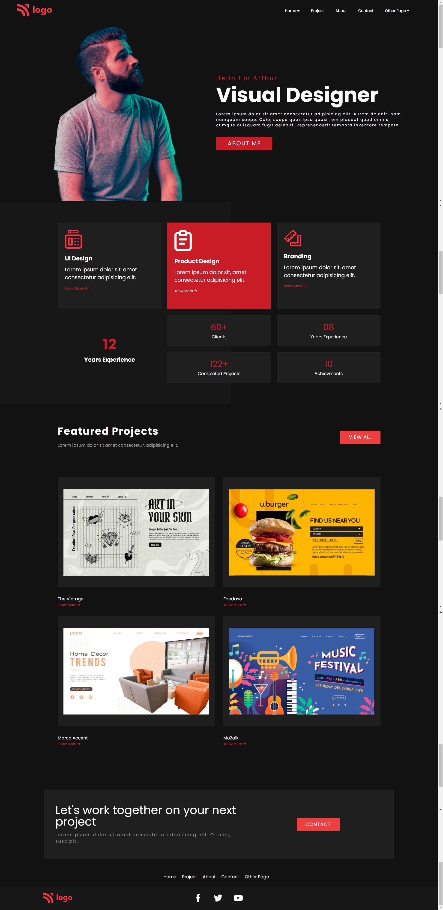
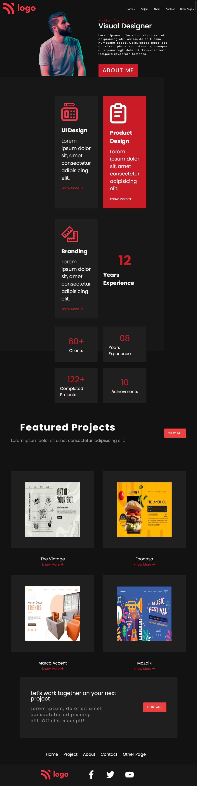
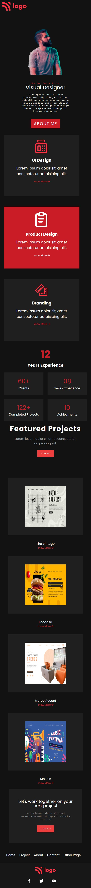

# Project-15 HTML & CSS Full Stack Javascript Web Development Course

## About

This project is created using HTML and CSS. I have used CSS Positioning to build this project, and this project is fully responsive.

## ⚙️ What did I learn by making this project?

-   learn more about using svg files.

## ⌛ Time taken to finish this project?

This project took me around 2 and half hour to finish.

## 📷 Screenshots

